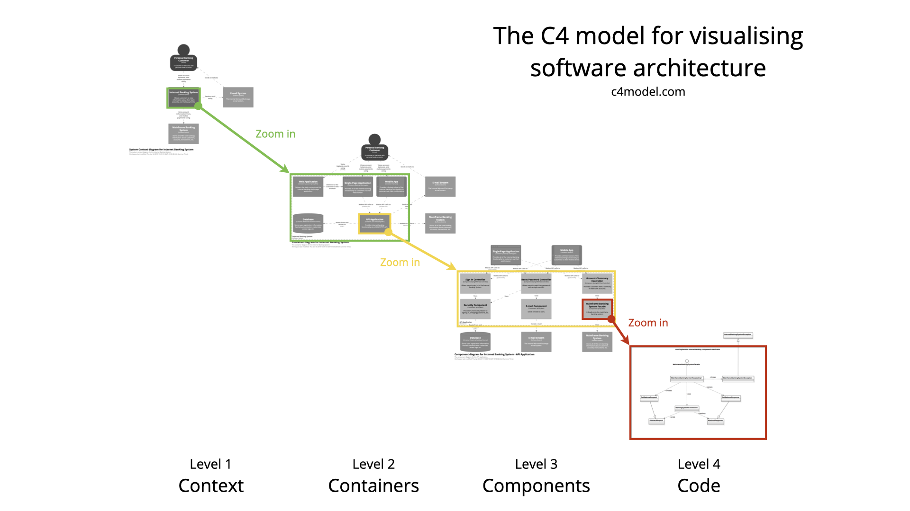

# c4-model

## C4 模型整体介绍

C4 是软件架构可视化的一种方案。架构可视化，指的是用图例的方式，把软件架构设计准确、清晰、美观地表示出来。架构可视化不是指导开发者如何进行架构设计，而是指导开发者将架构设计表达出来，产出简洁直观的架构图。

架构可视化的方法有很多，主流的有“4+1”视图模型、C4 模型。视图模型描述的是架构本身，架构确定之后，不管用什么模型去表达，本质上都应该是一样的，并没有优劣之分。

C4 模型是一种易于学习、对开发人员友好的软件架构图示方法，C4 模型没有规定使用特定的图形、特定的建模语言来画图，因而使用者可以非常灵活地产出架构图。

C4 模型将系统从上往下分为 Context, Containers, Components, Code 四层视图，每一层都是对上一层的完善和展开，层层递进地对系统进行描述，如下图。

## Context

Context（系统上下文）视图位于顶层，是软件系统架构图的起点，表达的是系统的全貌.Context 视图重点展示的是系统边界、系统相关的用户、其他支撑系统以及与本系统的交互。本层不涉及到具体细节（例如技术选型、协议、部署方案和其他低级细节），因此 Context 可以很好地向非技术人员介绍系统。

最高 Level 的架构图，不暴露系统的内部细节，主要展现：

- 本系统的用户是谁
- 与哪些外部系统有交互

## Containers

Container（容器）视图是对 Context 的放大，是对 Context 细节的补充。

注意这里的容器，指的不是 Docker 等容器中间件。Container 的描述范围是一个可单独运行/可部署的单元。Container 一般指的是应用以及依赖的中间件，例如服务器端 Web 应用程序、单页应用程序、桌面应用程序、移动应用程序、数据库架构、文件系统、Redis、ElasticSeach、MQ 等。

Container 显示了软件架构的高级形状以及系统内各容器之间的职责分工。

在 Container 这一层，还显示了系统的主要的技术选型以及容器间的通信和交互。

Container 视图没有说明部署方案、集群、复制、故障转移等。部署相关的视图，会通过 Deployment 视图进行展示。

## Components

将单个容器放大，则显示了该容器内部的组件。Component（组件）视图显示了一个容器是如何由许多“组件”组成的，每个组件是什么，它们的职责以及技术实现细节。

## Code

放大组件视图，则得到出组件的 Code 视图（代码视图）。

Code 视图一般采用 UML 类图、ER 图等。Code 视图是一个可选的详细级别，通常可以通过 IDE 等工具按需生成。除了最重要或最复杂的组件外，不建议将这种详细程度用于其他任何内容。

在注重敏捷开发的今天，一般不建议产出 Code 视图。

## 总结

| 作用                                                                         | 范围                                                                                                                                                                                          | 主要元素                                                                          | 支持元素                                                                                                                                       | 目标受众                                                              | 推荐给大多数团队                                |
| :--------------------------------------------------------------------------- | :-------------------------------------------------------------------------------------------------------------------------------------------------------------------------------------------- | :-------------------------------------------------------------------------------- | :--------------------------------------------------------------------------------------------------------------------------------------------- | :-------------------------------------------------------------------- | :---------------------------------------------- |
| 清晰地展示待构建的系统、用户以及现有的 IT 基础设施。                         | 待描述的核心系统以及其相关用户、支撑系统，不应该出现与核心系统无关的其他系统。例如我们要描述一个打车系统，不应该把无关联的药店系统绘制进去，并且要确保一个 Context 只有一个待描述的软件系统。 | Context 内待描述的软件系统。                                                      | 在范围内直接与主要元素中的软件系统有关联的人员（例如用户、参与者、角色）和外部依赖系统。通常，这些外部依赖系统位于我们自己的软件系统边界之外。 | 软件开发团队内外的所有人，包括技术人员和非技术人员。                  | 是的。                                          |
| 展示系统整体的开发边界，体现高层次的技术选型，暴露系统内容器之间的分工交互。 | 单个软件系统，关注的系统内部的应用构成。                                                                                                                                                      | 软件系统范围内的容器，例如 Spring Boot 打包后的应用，MySQL 数据库、Redis、MQ 等。 | 直接使用容器的人员和外部依赖系统。                                                                                                             | 软件开发团队内外的技术人员，包括软件架构师、开发人员和运营/支持人员。 | 是的。                                          |
| 展示了可执行的容器内部构成与分工，可直接指导开发。                           | 单个容器。                                                                                                                                                                                    | 范围内容器内的组件，通常可以是 Dubbo 接口、REST 接口、Service、Dao 等。           | 直接连接到容器的人员和外部依赖系统。                                                                                                           | 软件架构师和开发人员。                                                | 用于指导开发，当有需要时创建。                  |
|                                                                              | 单个组件。                                                                                                                                                                                    | 范围内组件内的代码元素（例如类、接口、对象、函数、数据库表等）。                  |                                                                                                                                                | 软件架构师和开发人员。                                                | 不，大多数 IDE 可以按需生成这种级别的详细信息。 |

> 参考链接：https://blog.csdn.net/mclongyi/article/details/131142989
