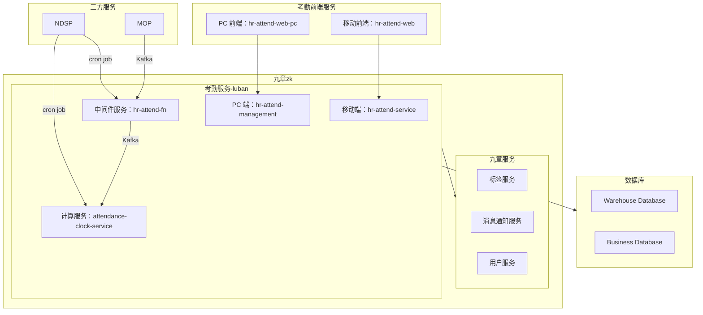

```mermaid
graph TB
  %% 实体
  %% 九章zk
  subgraph 考勤前端服务
    PCW[PC 前端：hr-attend-web-pc]
    APPW[移动前端：hr-attend-web]
  end

  subgraph 九章zk
    subgraph 九章服务
      LABEL[标签服务]
      MSG[消息通知服务]
      USS[用户服务]
    end

    subgraph 考勤服务-luban
      PC[PC 端：hr-attend-management]
      APP[移动端：hr-attend-service]
      CLAC[计算服务：attendance-clock-service]
      MOM[中间件服务：hr-attend-fn]
    end
  end

  %% 三方服务
  subgraph 三方服务
    NDSP[NDSP]
    MOP[MOP]
  end

  %% 数据库
  subgraph 数据库
    WH[Warehouse Database]
    BD[Business Database]
  end

  %% 系统关系
  考勤服务-luban --> 九章服务
  考勤服务-luban --> 数据库

  PCW --> PC
  APPW --> APP

  NDSP --> |cron job| MOM
  NDSP --> |cron job| CLAC

  MOP -->|Kafka| MOM
  MOM -->|Kafka| CLAC
```