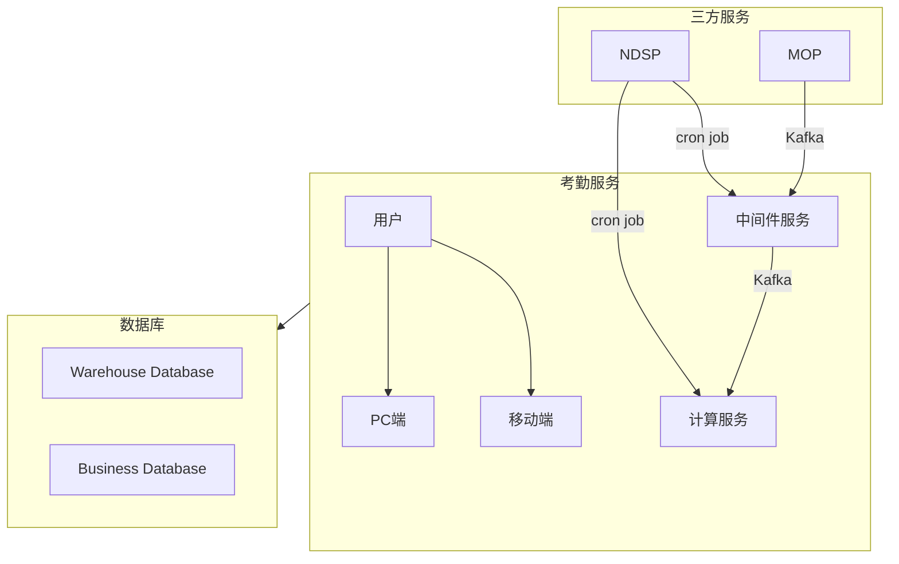

```mermaid
graph TB
  %% 实体
  %% 考勤服务
  subgraph 考勤服务
    USER[用户]
    PC[PC端]
    APP[移动端]
    CLAC[计算服务]
    MOM[中间件服务]
  end

  %% 三方服务
  subgraph 三方服务
    NDSP[NDSP]
    MOP[MOP]
  end

  %% 数据库
  subgraph 数据库
    WH[Warehouse Database]
    BD[Business Database]
  end

  %% 系统关系
  USER --> PC
  USER --> APP

  NDSP --> |cron job| MOM
  NDSP --> |cron job| CLAC

  MOP -->|Kafka| MOM
  MOM -->|Kafka| CLAC

  考勤服务 --> 数据库
```